# StayBnB

## Introduction

StayBnb: Your go-to platform for unique accommodations worldwide. Inspired by Airbnb, StayBnb offers seamless booking for diverse lodging options, from vacation rentals to boutique hotels. With user-friendly features, StayBnb redefines travel, ensuring memorable stays wherever you go. Join us and explore the world like never before.

## Project Type

Frontend:

The project is a primarily front-end project which utilizes a mock server to simulate back-end.

## Deplolyed App

Frontend: https://stay-bnb-in.vercel.app/

Backend: https://staybnb-server.onrender.com/

## Directory Structure

```

StayBnB
├── .gitignore
├── BackEnd/
│   ├── .gitignore
│   ├── db.json
│   ├── package-lock.json
│   ├── package.json
│   ├── products.json
│   ├── server.js
│   └── test.rest
├── FrontEnd/
│   ├── .eslintrc.cjs
│   ├── .gitignore
│   ├── README.md
│   ├── index.html
│   ├── package-lock.json
│   ├── package.json
│   ├── public/
│   │   ├── logo/
│   │   │   ├── logo.png
│   │   │   └── long-logo.png
│   │   └── vite.svg
│   ├── src/
│   │   ├── App.tsx
│   │   ├── assets/
│   │   │   ├── chip.png
│   │   │   ├── filter image/
│   │   │   │   └── filterImage.ts
│   │   │   ├── logo/
│   │   │   │   ├── logo.png
│   │   │   │   └── long-logo.png
│   │   │   ├── signin-image.jpg
│   │   │   ├── signup-image.jpg
│   │   │   └── visa.png
│   │   ├── components/
│   │   │   ├── .dummy
│   │   │   ├── Admin/
│   │   │   │   ├── InitialFocus.tsx
│   │   │   │   ├── Sidebar.tsx
│   │   │   │   └── apiService/
│   │   │   │   │   ├── FetchProperty.tsx
│   │   │   │   │   ├── PostData.tsx
│   │   │   │   │   └── fetchData.tsx
│   │   │   ├── Body/
│   │   │   │   ├── CardContainer.tsx
│   │   │   │   ├── CardSkeleton.tsx
│   │   │   │   └── Cards.tsx
│   │   │   ├── Checkout/
│   │   │   │   ├── Checkout.css
│   │   │   │   ├── Checkout.tsx
│   │   │   │   ├── Payment.tsx
│   │   │   │   ├── PaymentAlert.jsx
│   │   │   │   └── payment.css
│   │   │   ├── Footer/
│   │   │   │   ├── Footer.tsx
│   │   │   │   ├── FooterCopyright.tsx
│   │   │   │   ├── FooterLanguageCountry.tsx
│   │   │   │   ├── FooterPrivacyPolicy.tsx
│   │   │   │   └── FooterSocial.tsx
│   │   │   ├── Header/
│   │   │   │   ├── FilterBar.tsx
│   │   │   │   ├── FilterResponsive.tsx
│   │   │   │   ├── Navbar.tsx
│   │   │   │   └── NavbarFilter.tsx
│   │   │   ├── LoginSignup/
│   │   │   │   ├── Login.tsx
│   │   │   │   └── Signup.tsx
│   │   │   └── PropertyPage/
│   │   │   │   ├── Map.tsx
│   │   │   │   └── PropertyDetails.tsx
│   │   ├── main.tsx
│   │   ├── pages/
│   │   │   ├── Admin.tsx
│   │   │   ├── Home.tsx
│   │   │   ├── LoginSignUp.tsx
│   │   │   ├── Property.tsx
│   │   │   └── Wishlist.tsx
│   │   ├── redux/
│   │   │   ├── action.ts
│   │   │   ├── actionTypes.ts
│   │   │   ├── authReducer.ts
│   │   │   └── store.ts
│   │   ├── routes/
│   │   │   ├── AllRoutes.tsx
│   │   │   └── PrivateRoute.tsx
│   │   ├── styles/
│   │   │   ├── AdminPage.css
│   │   │   ├── App.css
│   │   │   ├── Footer/
│   │   │   │   └── footer.css
│   │   │   ├── LoginSignup/
│   │   │   │   ├── css/
│   │   │   │   │   ├── style.css
│   │   │   │   │   └── style.css.map
│   │   │   │   ├── fonts/
│   │   │   │   │   └── material-icon/
│   │   │   │   │   │   ├── css/
│   │   │   │   │   │   │   ├── material-design-iconic-font.css
│   │   │   │   │   │   │   └── material-design-iconic-font.min.css
│   │   │   │   │   │   └── fonts/
│   │   │   │   │   │   │   ├── Material-Design-Iconic-Font.eot
│   │   │   │   │   │   │   ├── Material-Design-Iconic-Font.svg
│   │   │   │   │   │   │   ├── Material-Design-Iconic-Font.ttf
│   │   │   │   │   │   │   ├── Material-Design-Iconic-Font.woff
│   │   │   │   │   │   │   └── Material-Design-Iconic-Font.woff2
│   │   │   │   └── scss/
│   │   │   │   │   ├── common/
│   │   │   │   │   ├── layouts/
│   │   │   │   │   └── style.scss
│   │   │   ├── cards.css
│   │   │   ├── filterBar.css
│   │   │   ├── index.css
│   │   │   ├── navbar.css
│   │   │   └── propertyPageStyle/
│   │   ├── utils/
│   │   └── vite-env.d.ts
│   ├── tsconfig.json
│   ├── tsconfig.node.json
│   └── vite.config.ts
├── README.md

```

## Video Walkthrough of the project

A detailed walkthrough of all the features of our project can be found here:

https://youtu.be/LvAEtXPFIic

## Video Walkthrough of the codebase

A quick walkthrough of the project can be found here: 

https://youtu.be/lMl3_aH_QPw

## Features

- Responsive and dynamic website
- User authentication
- Admin Dashboard and CRUD Operations
- Add property to favorites
- Search and filter property using search param
- Private routes

## Design Decisions or Assumptions

The project is a clone of the popular rental booking website Airbnb. To facilitate the proper design and flow of our project following assumptions were made :

- One admin for all CRUD operations instead of multiple admins and super admin
- One wishlist per user
- User must be logged in to access the wishlist or add property to the wishlist
- Admin user does not need to access the main website and is redirected to the admin dashboard

## Installation & Getting started

To run the frontend website, enter the following commands in your terminal:

```bash
# Move into the FrontEnd Directory
cd FrontEnd/

# Install all dependencies
npm install

# Run the dev server
npm run dev
```

The project uses a mock server deployed using JSON-server on render. The server can be accessed here: https://staybnb-server.onrender.com/

If you would like to run a local server instead, use the following commands:

```bash
# Move into the BackEnd directory
cd BackEnd/

# Run the server
npm run start
```

Warning: The project is built around the deployed server which can be accessed using the above link. Running a local server might cause some unwanted changes.

## Usage

The website lands on the home page. On the home page, the following functions can be performed:

1. Get required property data. Use search and filters to filter the data according to requirements.

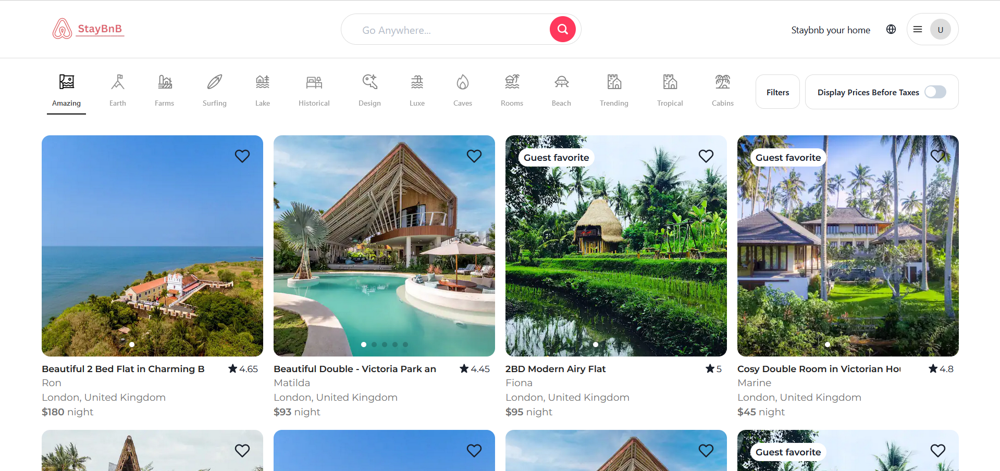

2. You can log in by clicking on the dropdown icon on the right-hand side.

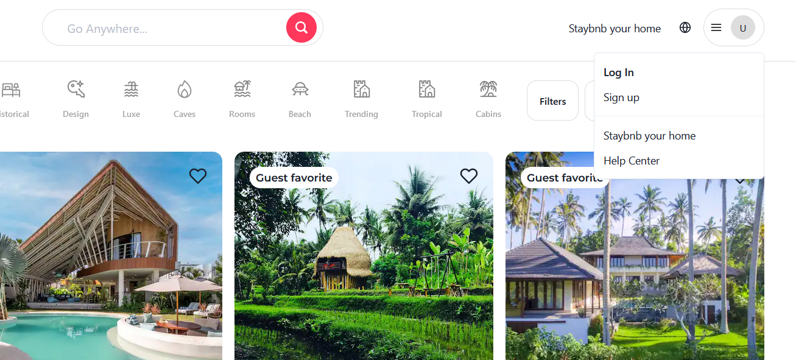

On mobile view, the login button is available in the lower right corner of the bottom navbar instead.

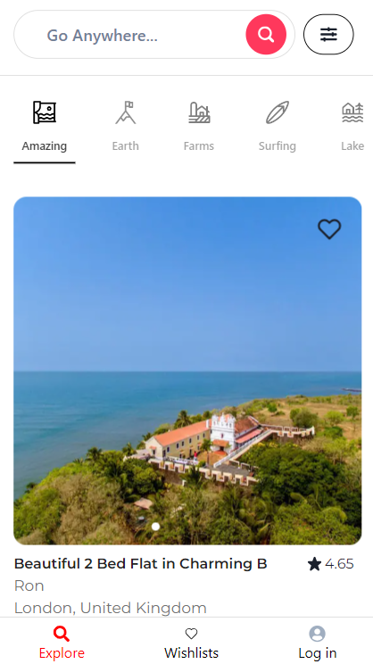

3. If you are logged in, you can add any property to your wishlist. Just click on the heart icon to add a property to your wishlist. If you are not logged in, clicking on the heart icon will instead trigger a prompt asking you to log in.

Properties can not be added to the wishlist without logging in.

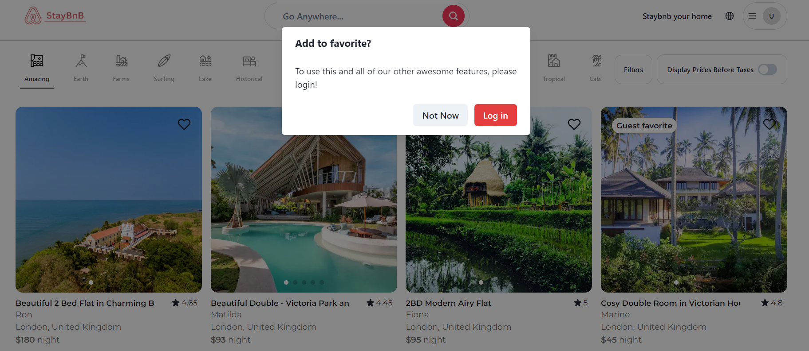

You can route to the login and signup page by either clicking the login or signup buttons in the dropdown menu or by clicking the login button on the prompt. On mobile view, the login page can be reached by clicking on the login button in the right-hand corner of the bottom nav bar.

Once on the login page, you can log in or signup based on your choice. Currently admin can not sign up and you must use the provided admin credentials if you wish to log in as admin:

1. Enter a valid email and password to sign in. You may use the following credentials if you want :

- Admin :

  email: admin@admin.com

  password: adminPass@123

- User :

  email: user@user.com

  password: 123456789

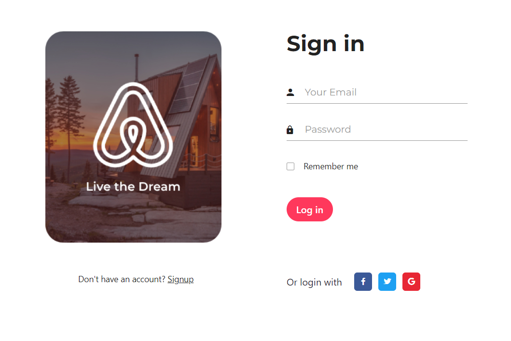

2. You can also sign up if you so choose. Enter a valid email and password and a valid name. You can only sign up as a user and not an admin.

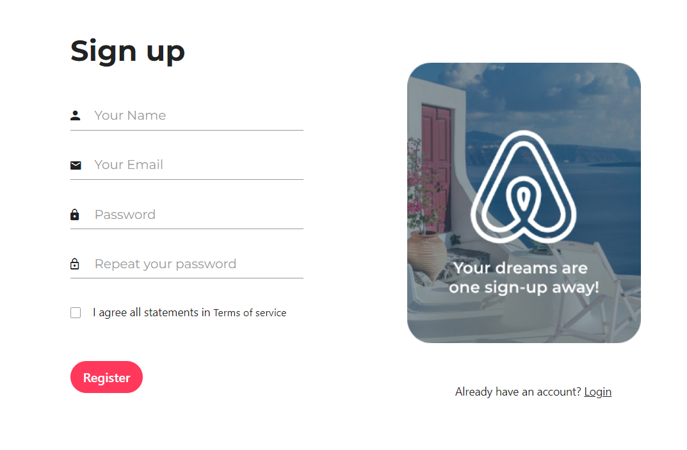

Once logged in, you will be either redirected to the home page (if you signed as a user) or the admin page (if you used the provided admin credentials)

On the home page, you may access a user-specific wishlist which can be used to store your favourite properties.

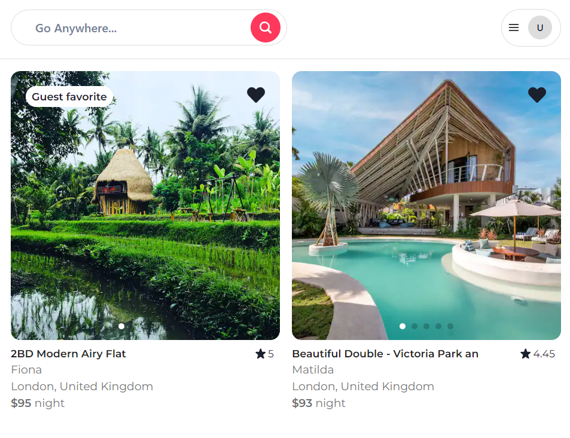

Wishlist can only be accessed if you are logged in as a user. Accessing the wishlist without logging in will prompt you to sign in and will not display any data.

To access the property details, you can click on the body of the property card and it will redirect you to the property details page.

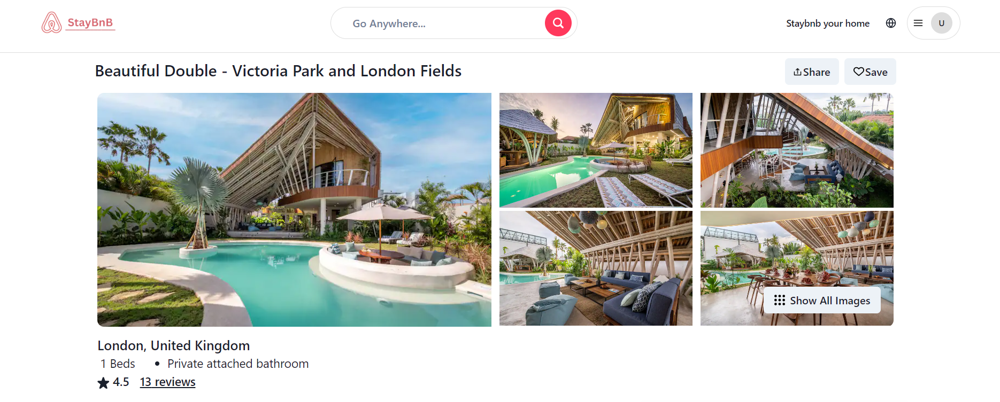

You can use the form on the right-hand side (bottom bar on mobile view) to enter your check-in and check-out dates and add more guest-specific information if needed.
You will be displayed your total costs depending upon the price per night of property and the number of nights you have decided to stay.
You may also change the overall number of guests.

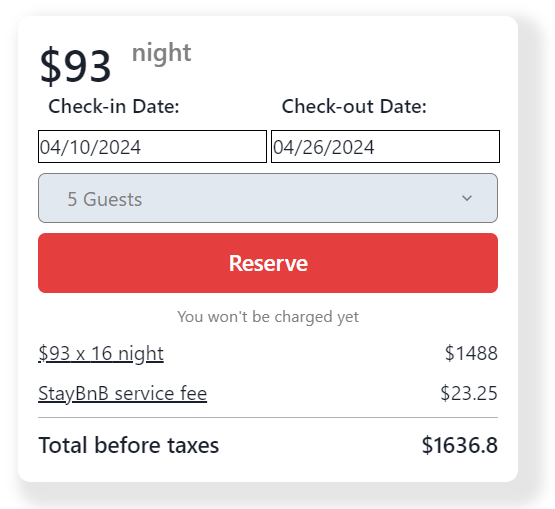

Clicking on the reserve button will redirect you to the checkout page.

On the checkout page, you can view  the property information and the total price one last time.
You can click on the confirm button to move onto the payments page.

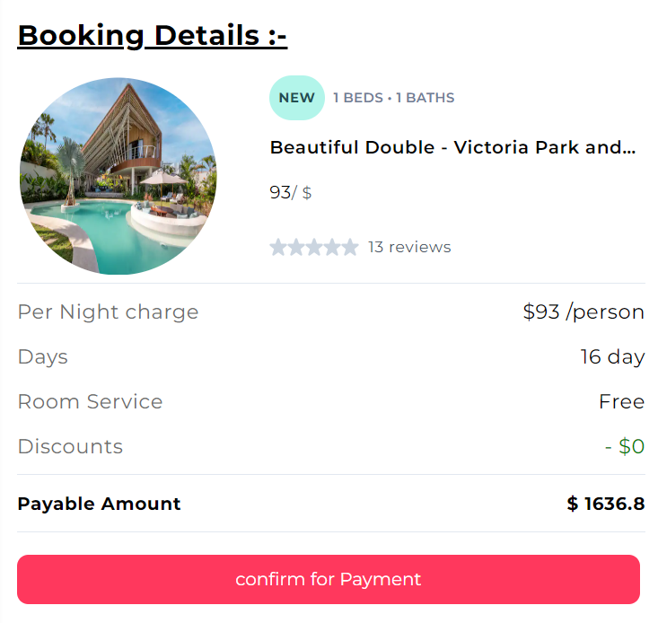

On the payments page, enter your card details and other credentials to finally confirm your payment. Once completed, you will be redirected to the home page.

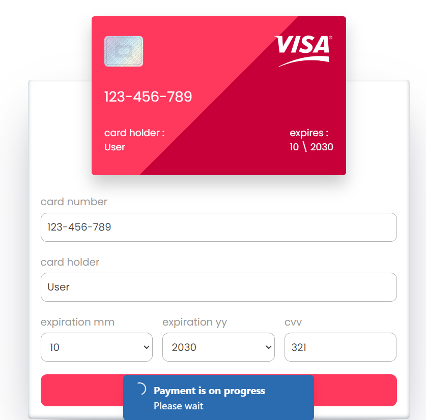

You can also sign in as an admin using the given credentials to access the ADMIN DASHBOARD.

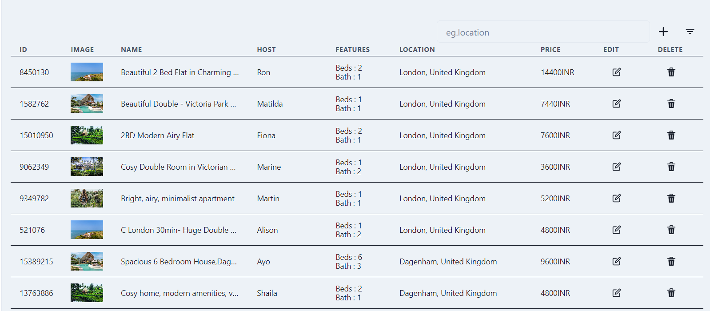

On the admin dashboard, you can:

    - Access all properties
    - Search for a specific property
    - Add, edit, and delete a property

## Credentials

For security purposes, the admin dashboard is a private route which can only be accessed using the following login credentials:

email: admin@admin.com

password: adminPass@123

Disclaimer: The admin email and password are case-sensitive and must be entered as they are provided

## API Endpoints

The deployed server can be used to fetch and sort any data. Further, it can be used to log in and register a user.

API : https://staybnb-server.onrender.com/

Endpoints: 

1. Property: 

- GET https://staybnb-server.onrender.com/property - retrieve all items
- GET https://staybnb-server.onrender.com//property/id - retrieve an item with the specific id
- POST https://staybnb-server.onrender.com/propery - create a new item
- PATCH https://staybnb-server.onrender.com/property/id - edit the item with a specific ID

2. users:

- GET https://staybnb-server.onrender.com/users - retrieve all users
- POST https://staybnb-server.onrender.com/register - register a new user
- POST https://staybnb-server.onrender.com/login - log in as an existing user

## Technology Stack

The tech stack used for the project:

FrontEnd :

- HTML
- CSS
- React Library
- Typescript

Backend :

- JSON-server and Json-server-auth

